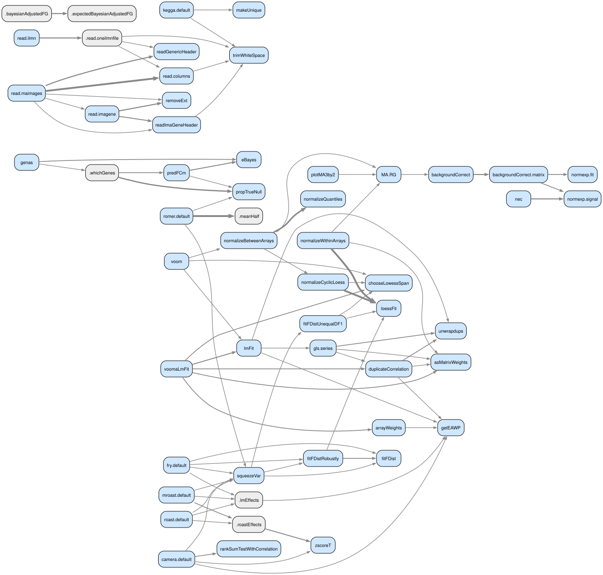
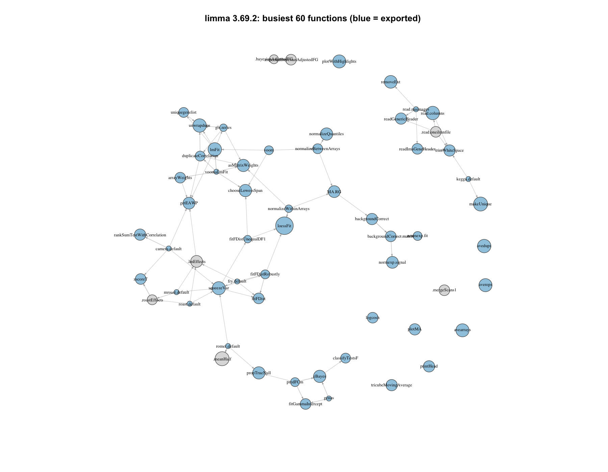

# Example: a call graph of limma

[limma](https://bioconductor.org/packages/limma) is a good first example
for call-graph analysis: 375 package symbols, mostly plain
functions with a deep helper layer, 56 S3/S4 methods
linked to generics, an `exportPattern` NAMESPACE, and no network or
`.onLoad` side effects. Everything here is reproducible with one script:

```bash
examples/limma/run.sh           # ~1 minute; needs R with limma installed
```

It clones limma from the Bioconductor git server at the commit matching the
installed version, runs the static pass, resolves against the installed
namespace (`scip-r resolve --installed limma`, no compile step), exports
the tables, and builds the graphs twice: with networkx
([call_graph.py](call_graph.py)) and with igraph ([call_graph.R](call_graph.R)).

## The graph

Busiest internal functions and the calls among them, from the networkx
script via Graphviz. Blue nodes are exported; grey are internal; edge
width is call count.



The igraph rendering of the same data (force-directed, busiest 60):



## What the numbers say

Resolve run `1244de7bbee973b2447732303853f3fa`. 375 package symbols, 252 internal call edges, 56 method-to-generic edges, 4004 edges into dependencies, 326 exported.

### Most-called internal functions (weighted in-degree)

| function | calls |
| --- | --- |
| `loessFit` | 36 |
| `makeUnique` | 12 |
| `.meanHalf` | 12 |
| `lmFit` | 10 |
| `unwrapdups` | 10 |
| `read.columns` | 10 |
| `squeezeVar` | 9 |
| `plotWithHighlights` | 9 |
| `removeExt` | 8 |
| `eBayes` | 7 |
| `asMatrixWeights` | 7 |
| `chooseLowessSpan` | 7 |
| `propTrueNull` | 7 |
| `normalizeQuantiles` | 7 |
| `getEAWP` | 6 |

### Functions with the most distinct callees

| function | callees |
| --- | --- |
| `read.maimages` | 8 |
| `lmFit` | 7 |
| `fry.default` | 6 |
| `romer.default` | 6 |
| `normalizeWithinArrays` | 5 |
| `genas` | 5 |
| `roast.default` | 5 |
| `kegga.default` | 5 |
| `normalizeBetweenArrays` | 5 |
| `voomaLmFit` | 5 |
| `arrayWeights` | 4 |
| `normexp.fit` | 4 |
| `backgroundCorrect.matrix` | 4 |
| `squeezeVar` | 4 |
| `propTrueNull` | 4 |

### PageRank

| function | score |
| --- | --- |
| `plotWithHighlights` | 0.0172 |
| `protectMetachar` | 0.0135 |
| `unwrapdups` | 0.0132 |
| `backgroundCorrect.matrix` | 0.0121 |
| `makeUnique` | 0.012 |
| `backgroundCorrect` | 0.012 |
| `squeezeVar` | 0.0092 |
| `weightedLowess` | 0.0082 |
| `removeExt` | 0.0078 |
| `lmFit` | 0.0077 |
| `loessFit` | 0.0075 |
| `.matvec` | 0.0074 |
| `trimWhiteSpace` | 0.0073 |
| `trigammaInverse` | 0.0072 |
| `rankSumTestWithCorrelation` | 0.0069 |

### Exported entry points reaching the most functions

| function | reachable |
| --- | --- |
| `voomWithQualityWeights` | 34 |
| `voom` | 29 |
| `genas` | 27 |
| `predFCm` | 23 |
| `neqc` | 22 |
| `roast.default` | 21 |
| `mroast.default` | 20 |
| `romer.default` | 19 |
| `decideTests.MArrayLM` | 18 |
| `normalizeBetweenArrays` | 18 |
| `as.matrix.RGList` | 17 |
| `camera.default` | 17 |
| `write.fit` | 17 |
| `eBayes` | 16 |
| `normalizeWithinArrays` | 16 |

### Dependency usage (call sites)

| package | calls |
| --- | --- |
| `base (r)` | 8521 |
| `graphics (r)` | 327 |
| `stats (r)` | 322 |
| `methods (r)` | 120 |
| `grDevices (r)` | 54 |
| `utils (r)` | 19 |
| `statmod (cran)` | 17 |
| `AnnotationDbi (bioconductor)` | 16 |
| `BiasedUrn (.)` | 16 |
| `Biobase (bioconductor)` | 14 |
| `base (.)` | 11 |
| `MASS (cran)` | 8 |
| `gplots (.)` | 5 |
| `ellipse (.)` | 4 |
| `vsn (.)` | 3 |
| `illuminaio (bioconductor)` | 3 |
| `splines (r)` | 2 |
| `locfit (cran)` | 2 |
| `affy (.)` | 1 |
| `GO.db (.)` | 1 |

### Internal functions with no static caller

`.onAttach`, `.onLoad`, `.onUnload`


Not proof of dead code: calls through `do.call`, `match.fun` or dispatch are invisible to the static pass.

### Recursion

Self-recursive: none

Mutually recursive groups: none

## How the edge list is built

One query over the `occurrences` table gives weighted call edges; the
`caller` column is the innermost enclosing top-level definition:

```sql
select caller as source, symbol as target, count(*) as weight
from occurrences
where caller is not null and not is_definition and not is_local
group by all;
```

`symbols` provides node attributes (`kind`, `exported`), `relationships`
provides method-to-generic edges, and the `manager`/`version` columns on
each target come from `scip-r resolve` (R 4.6.0,
Bioconductor 3.24, run `1244de7bbee973b2447732303853f3fa`).

## What indexing a real package taught us

Running this example surfaced three gaps in scip-r, fixed in the same
change:

- limma defines operator methods with `assign("[.RGList", function ...)`;
  top-level `assign()` with a literal name is now a definition.
- `"dimnames<-.MAList" <- .setdimnames` aliases a function; names
  registered in NAMESPACE as S3 methods are now treated as functions even
  when the right-hand side is not a `function` literal.
- The resolver dropped non-syntactic names such as `[` and `dimnames<-`
  and only reported versions for namespaces it had loaded; it now resolves
  every name scip-r asks about and reports versions and managers for
  installed dependencies referenced with `pkg::`.

## Caveats

- Edges are static. Calls through `do.call("fn")`, `match.fun` or
  `UseMethod` dispatch are not edges, and a call to a generic points at
  the generic, not at the method that would run. "No static caller"
  therefore means exactly that, not "dead".
- Vignettes and tests are not indexed yet, so exported entry points show
  no callers from outside `R/`.
- The 375-node graph includes classes and members; the
  metrics restrict to `kind = 'Function'` where it matters.
